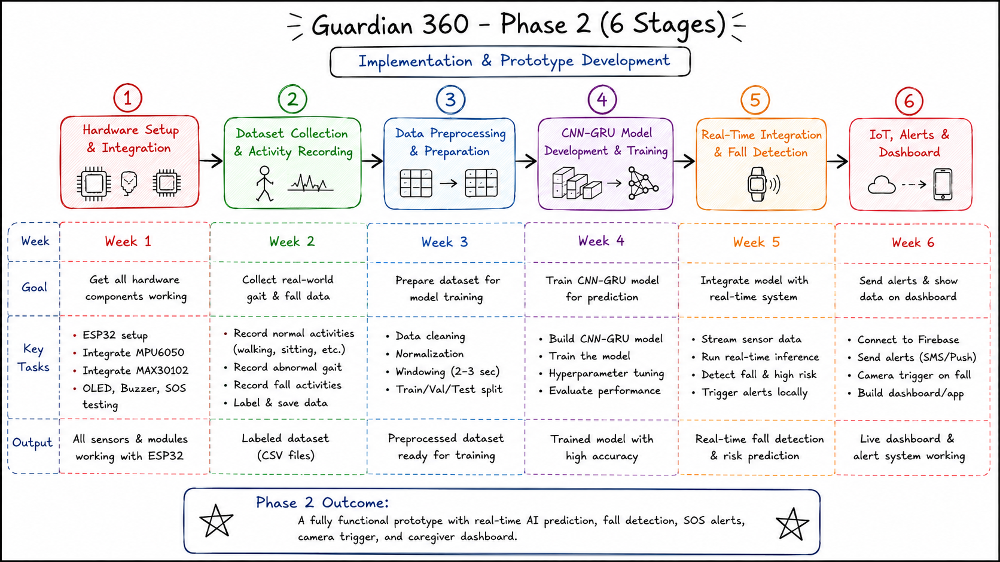

# Guardian 360

AI-powered elderly safety wearable for real-time gait analysis, fall detection, alerts, and caregiver monitoring.

## Tech Stack

### Hardware
- ESP32
- MPU6050
- MAX30102
- OLED Display
- Buzzer & SOS Button

### Software & AI
- Python
- TensorFlow
- CNN-GRU Model
- TensorFlow Lite

### Cloud & IoT
- Firebase
- WiFi
- Push/SMS Alerts

## Implementation Stages

## Features
- Real-time fall detection
- Abnormal gait detection
- Emergency alerts
- Camera trigger on fall
- Caregiver dashboard

